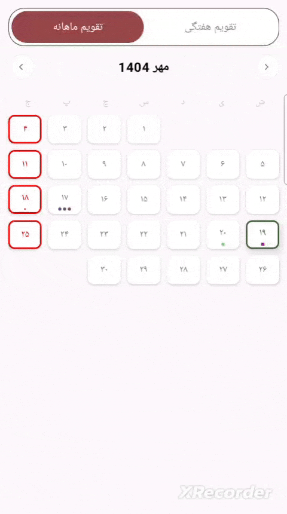

Excellent 👍  
 Here’s the **final, full, polished `README.md`** — now including your **two-column explanation table** right after the sample code section.  
 It’s fully ready to copy and paste into your GitHub repository (`EventCalendar/README.md`).

---

\# 📅 EventCalendar

\[\!\[Android\](https://img.shields.io/badge/Platform-Android-green.svg)\](https://developer.android.com)  
\[\!\[Kotlin\](https://img.shields.io/badge/Language-Kotlin-blue.svg)\](https://kotlinlang.org)  
\[\!\[Jetpack Compose\](https://img.shields.io/badge/UI-Jetpack%20Compose-purple.svg)\](https://developer.android.com/jetpack/compose)  
\[\!\[License\](https://img.shields.io/badge/License-MIT-yellow.svg)\](LICENSE)  
\[\!\[GitHub Stars\](https://img.shields.io/github/stars/MohShMehr/EventCalendar?style=social)\](https://github.com/MohShMehr/EventCalendar/stargazers)

\---

\#\#\# ✨ Overview

\*\*EventCalendar\*\* is an elegant and customizable Jetpack Compose calendar component that supports \*\*two display modes\*\* — \*Weekly\* and \*Monthly\* — allowing developers to easily display and manage user events with a simple, reactive API.

With built-in support for clickable event days and flexible customization, you can quickly integrate a calendar view into your Compose project without writing boilerplate UI code.

\---

\#\#\# 🖼️ Screenshots

| Monthly View | Weekly View |  
|:-------------:|:------------:|  
| \ | \ |

\---

\#\#\# 🎥 Demo (GIF Preview)

| Mode Switching |  
|:---------------:|  
| \ |

\---

\#\#\# 🛠️ Tech Stack

\- \*\*Android\*\*  
\- \*\*Kotlin\*\*  
\- \*\*Jetpack Compose\*\*  
\- \*\*Material 3 Design\*\*

\---

\#\#\# 🚀 Features

✅ Dual calendar modes — \*\*Monthly\*\* and \*\*Weekly\*\*    
✅ Highlight events with \*\*colors, icons, or custom composables\*\*    
✅ Easy event updates via reactive state management    
✅ Full \*\*Compose API integration\*\* (no XML)    
✅ Supports \*\*custom color themes\*\*    
✅ Simple \*\*state access and event listeners\*\*  

\---

\#\#\# 💻 Sample Usage

You can find a working example in the \`sample\` module.    
Here’s a snippet showing how to use \`EventCalendar\` in your app:

\`\`\`kotlin  
@Composable  
private fun CalendarEvents() {  
    //you can get all calendar event clicks here  
    val calendarState \= rememberCalendarEventsState(  
        initialTabIndex \= 1,  
        onWeeklySelectedDateChange \= {  
            Log.d("CalendarEvents", "get selected date in weekly calendar")  
        },  
        onMonthlySelectedDateChange \= {  
            Log.d("CalendarEvents", "get selected date in monthly calendar")  
        },  
        onCurrentWeekChange \= {  
            Log.d("CalendarEvents", "get current date in next or previous week")  
        },  
        onCurrentMonthChange \= {  
            Log.d("CalendarEvents", "get current date in next or previous month")  
        },  
    )

    val eventImage \= painterResource(android.R.drawable.ic\_delete)

    //you can also update weekly calendar events by your data here  
    LaunchedEffect(calendarState.weekState.weeklyCurrentDate) {  
        val date \= calendarState.weekState.weeklyCurrentDate  
        val weekEventsMap: Map\<DateId, CalendarEvent\> \= mapOf(  
            DateId(date.year, date.month, date.day \+ 1\) to CircleColorEvent(  
                color \= Color(0xFF5BCD85)  
            ),  
            DateId(date.year, date.month, date.day) to RectangleColorEvent(  
                color \= Color(0xFF9C27B0)  
            ),  
            DateId(date.year, date.month, date.day \- 1\) to PictureEvent(  
                painter \= eventImage  
            ),  
            DateId(date.year, date.month, date.day \- 2\) to CustomEvent(  
                content \= { CustomEventView() }  
            )  
        )  
        calendarState.weekState.updateEvents(weekEventsMap)  
    }

    //you can also update monthly calendar events by your data here  
    LaunchedEffect(calendarState.monthState.monthlyCurrentDate) {  
        val date \= calendarState.monthState.monthlyCurrentDate  
        val weekEventsMap: Map\<DateId, CalendarEvent\> \= mapOf(  
            DateId(date.year, date.month, date.day \+ 1\) to CircleColorEvent(  
                color \= Color(0xFF5BCD85)  
            ),  
            DateId(date.year, date.month, date.day) to RectangleColorEvent(  
                color \= Color(0xFF9C27B0)  
            ),  
            DateId(date.year, date.month, date.day \- 1\) to PictureEvent(  
                painter \= eventImage  
            ),  
            DateId(date.year, date.month, date.day \- 2\) to CustomEvent(  
                content \= { CustomEventView() }  
            )  
        )  
        calendarState.monthState.updateEvents(weekEventsMap)  
    }

    //customize your calendar  
    Column(  
        modifier \= Modifier  
            .fillMaxSize()  
            .padding(10.dp)  
    ) {  
        CalendarEventsView(  
            state \= calendarState,  
            modifier \= Modifier.fillMaxWidth(),  
            tabBorderColor \= Color(0xFF5E5E5E),  
            tabSelectedColor \= Color(0xFF964747),  
            selectedDayColor \= Color(0xFF3B6232),  
            holidayDayColor \= Color(0xFFFF0000),  
            dayColor \= Color(0xFF7C7C7C),  
            dayNameColor \= Color(0xFFCCCCCC)  
        )  
    }  
}

---

### **📘 Explanation of the Sample Code**

| Usage | Description |
| ----- | ----- |
| `rememberCalendarEventsState(...)` | Initializes and remembers the main state of the calendar, handling both **weekly** and **monthly** modes, along with event callbacks. |
| `initialTabIndex = 1` | Defines the default tab when the calendar loads — `0` for **Weekly**, `1` for **Monthly**. |
| `onWeeklySelectedDateChange` | Triggered when the user selects a new date in **weekly** mode. |
| `onMonthlySelectedDateChange` | Triggered when the user selects a new date in **monthly** mode. |
| `onCurrentWeekChange` | Called when the user navigates to the **previous** or **next** week. |
| `onCurrentMonthChange` | Called when the user navigates to the **previous** or **next** month. |
| `eventImage = painterResource(...)` | Loads a drawable resource to show image events. |
| `LaunchedEffect(calendarState.weekState.weeklyCurrentDate)` | Reactively listens for week changes and updates event markers dynamically. |
| `CircleColorEvent(color = Color(...))` | Displays a **circle** marker on a specific date. |
| `RectangleColorEvent(color = Color(...))` | Displays a **rectangle** marker on a specific date. |
| `PictureEvent(painter = eventImage)` | Displays an **image/icon** as a date marker. |
| `CustomEvent(content = { CustomEventView() })` | Lets you provide a **custom composable** as your event marker. |
| `calendarState.weekState.updateEvents(...)` | Updates the visible weekly events. |
| `calendarState.monthState.updateEvents(...)` | Updates the visible monthly events. |
| `CalendarEventsView(...)` | The main composable that renders the full calendar UI with your chosen colors. |
| `tabBorderColor`, `tabSelectedColor` | Customize **tab bar border and selected color**. |
| `selectedDayColor`, `holidayDayColor` | Set colors for **selected days** and **holidays**. |
| `dayColor`, `dayNameColor` | Define text colors for day numbers and names. |
| `Modifier.fillMaxWidth().padding(10.dp)` | Ensures proper spacing and responsive layout. |

---

### **⚙️ Setup & Run (Sample Module)**

To explore the calendar quickly:

Clone the repository:

 git clone https://github.com/MohShMehr/EventCalendar.git

1.   
2. Open the project in **Android Studio** (Giraffe+ or newer).

3. Select the `sample` module from the run configuration dropdown.

4. Click **Run ▶️** to launch the demo app and test the calendar in action.

---

### **🧩 Customization**

You can create custom events using `CustomEvent` or extend the base `CalendarEvent` class.  
 Example:

DateId(year, month, day) to CustomEvent {  
    Box(  
        modifier \= Modifier  
            .size(6.dp)  
            .background(Color.Magenta, shape \= CircleShape)  
    )  
}

---

### **🧠 How It Works**

* Uses `rememberCalendarEventsState()` to store and update current date states.

* Separates **Monthly** and **Weekly** states for independent control.

* Handles all transitions, selections, and redraws automatically with Compose reactivity.

---

### **🤝 Contributing**

Contributions are welcome\!  
 If you'd like to improve **EventCalendar**:

1. Fork the repository

Create a new branch:

 git checkout \-b feature/amazing-feature

2. 

Commit your changes:

 git commit \-m 'Add amazing feature'

3. 

Push to your branch:

 git push origin feature/amazing-feature

4.   
5. Submit a pull request 🎉

---

### **📦 Installation (coming soon)**

The library will be available via **GitHub Packages**:

implementation("com.github.MohShMehr:event-calendar:1.0.0")

*(If not yet published, clone and include as a module manually.)*

---

### **🪪 License**

This project is licensed under the **MIT License** — see the [LICENSE](https://chatgpt.com/g/g-p-68d4e8659c1c8191a742a788757d2363-morz/c/LICENSE) file for details.

---

### **💬 Support**

⭐ Star the repo if you like it\!  
 Feel free to open [issues](https://github.com/MohShMehr/EventCalendar/issues) or [pull requests](https://github.com/MohShMehr/EventCalendar/pulls) for any feedback or improvements.

---

**Author:** [Mohammad Reza Sheikhi](https://github.com/MohShMehr)

