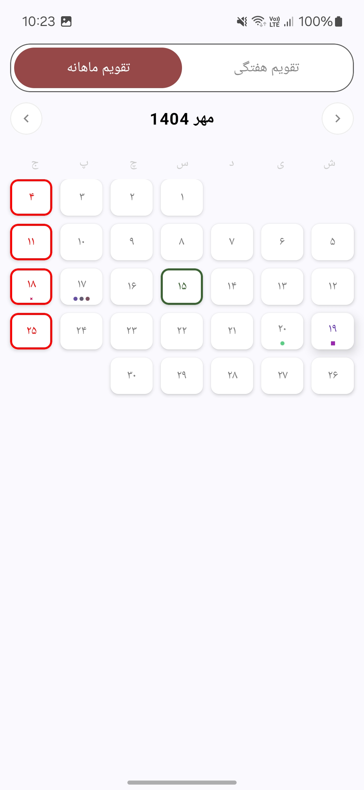
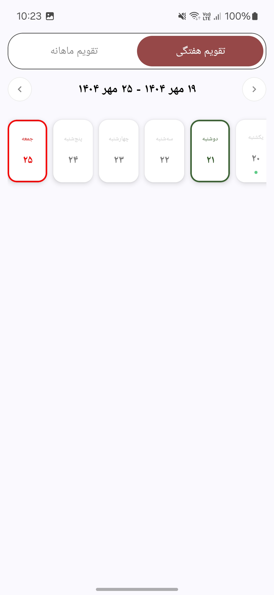

# 📅 EventCalendar

[](https://developer.android.com)
[](https://kotlinlang.org)
[](https://developer.android.com/jetpack/compose)
[](LICENSE)
[](https://github.com/MohShMehr/EventCalendar/stargazers)

---

### ✨ Overview

**EventCalendar** is an elegant and customizable Jetpack Compose calendar component that supports **two display modes** — *Weekly* and *Monthly* — allowing developers to easily display and manage user events with a simple, reactive API.


With built-in support for clickable event days and flexible customization, you can quickly integrate a calendar view into your Compose project without writing boilerplate UI code.

---

### 🖼️ Screenshots

| Monthly View | Weekly View |  
|:-------------:|:------------:|  
|  |  |

---

### 🎥 Demo (GIF Preview)

| Mode Switching |  
|:---------------:|  
|  |


---

## 🚀 Installation

Step 1. Add the JitPack repository to your build file

```kotlin
dependencyResolutionManagement {
    repositoriesMode.set(RepositoriesMode.FAIL_ON_PROJECT_REPOS)
    repositories {
        google()
        mavenCentral()
        maven { url = uri("https://jitpack.io") }
    }
}
```
Step 2. Add the dependency

```kotlin
dependencies {
    implementation("com.github.MohShMehr:EventCalendar:<latest-version>")
}
```

---

### 🛠️ Tech Stack

- **Android**
- **Kotlin**
- **Jetpack Compose**
- **Material 3 Design**

- ---

### 🚀 Features

✅ Dual calendar modes — **Monthly** and **Weekly**  
✅ Highlight events with **colors, icons, or custom composables**  
✅ Easy event updates via reactive state management  
✅ Full **Compose API integration** (no XML)  
✅ Supports **custom color themes**  
✅ Simple **state access and event listeners**  

---

### 💻 Sample Usage


You can find a working example in the `sample` module.    
Here’s a snippet showing how to use `EventCalendar` in your app:

```kotlin
@Composable
private fun CalendarEvents() {
    // You can get all calendar event clicks here
    val calendarState = rememberCalendarEventsState(
        initialTabIndex = 1,
        onWeeklySelectedDateChange = {
            Log.d("CalendarEvents", "get selected date in weekly calendar")
        },
        onMonthlySelectedDateChange = {
            Log.d("CalendarEvents", "get selected date in monthly calendar")
        },
        onCurrentWeekChange = {
            Log.d("CalendarEvents", "get current date in next or previous week")
        },
        onCurrentMonthChange = {
            Log.d("CalendarEvents", "get current date in next or previous month")
        },
    )

    val eventImage = painterResource(android.R.drawable.ic_delete)

    //You can also update weekly calendar events with your data here
    LaunchedEffect(calendarState.weekState.weeklyCurrentDate) {
        val date = calendarState.weekState.weeklyCurrentDate
        val weekEventsMap: Map<DateId, CalendarEvent> = mapOf(
            DateId(date.year, date.month, date.day + 1) to CircleColorEvent(
                color = Color(0xFF5BCD85)
            ),
            DateId(date.year, date.month, date.day) to RectangleColorEvent(
                color = Color(0xFF9C27B0)
            ),
            DateId(date.year, date.month, date.day - 1) to PictureEvent(
                painter = eventImage
            ),
            DateId(date.year, date.month, date.day - 2) to CustomEvent(
                content = { CustomEventView() }
            )
        )
        calendarState.weekState.updateEvents(weekEventsMap)
    }

    // you can also update monthly calendar events with your data here
    LaunchedEffect(calendarState.monthState.monthlyCurrentDate) {
        val date = calendarState.monthState.monthlyCurrentDate
        val weekEventsMap: Map<DateId, CalendarEvent> = mapOf(
            DateId(date.year, date.month, date.day + 1) to CircleColorEvent(
                color = Color(0xFF5BCD85)
            ),
            DateId(date.year, date.month, date.day) to RectangleColorEvent(
                color = Color(0xFF9C27B0)
            ),
            DateId(date.year, date.month, date.day - 1) to PictureEvent(
                painter = eventImage
            ),
            DateId(date.year, date.month, date.day - 2) to CustomEvent(
                content = { CustomEventView() }
            )
        )
        calendarState.monthState.updateEvents(weekEventsMap)
    }

    //Customize your calendar
    Column(
        modifier = Modifier
            .fillMaxSize()
            .padding(10.dp)
    ) {
        CalendarEventsView(
            state = calendarState,
            modifier = Modifier.fillMaxWidth(),
            tabBorderColor = Color(0xFF5E5E5E),
            tabSelectedColor = Color(0xFF964747),
            selectedDayColor = Color(0xFF3B6232),
            holidayDayColor = Color(0xFFFF0000),
            dayColor = Color(0xFF7C7C7C),
            dayNameColor = Color(0xFFCCCCCC)
        )
    }
}
```


📘 More **Docs**

| **Code Reference** | **Description** |
| ----- | ----- |
| `CalendarEventsView(...)` | The main composable that renders the full calendar UI with your chosen colors. |
| `rememberCalendarEventsState` | Initializes and remembers the main state of the calendar, handling both **weekly** and **monthly** modes, along with event callbacks. |
| `initialTabIndex` | Defines the default tab when the calendar loads — `0` for **Weekly**, `1` for **Monthly**. |
| `onWeeklySelectedDateChange` | Triggered when the user selects a new date in **weekly** mode. |
| `onMonthlySelectedDateChange` | Triggered when the user selects a new date in **monthly** mode. |
| `onCurrentWeekChange` | Called when the user navigates to the **previous** or **next** week. |
| `onCurrentMonthChange` | Called when the user navigates to the **previous** or **next** month. |
| `CircleColorEvent` | Displays a **circle** marker on a specific date. |
| `RectangleColorEvent` | Displays a **rectangle** marker on a specific date. |
| `PictureEvent` | Displays an **image/icon** as a date marker. |
| `CustomEvent` | Lets you provide a **custom composable** as your event marker. |
| `calendarState.weekState.updateEvents(...)` | Updates the visible weekly events. |
| `calendarState.monthState.updateEvents(...)` | Updates the visible monthly events. |
| `tabBorderColor`, `tabSelectedColor` | Customize **tab bar border and selected color**. |
| `selectedDayColor`, `holidayDayColor` | Set colors for **selected days** and **holidays**. |
| `dayColor`, `dayNameColor` | Define text colors for day numbers and names. |

---

### **⚙️ Setup & Run (Sample Module)**

To explore the calendar quickly:

Clone the repository:

1. Run git clone https://github.com/MohShMehr/EventCalendar.git 
2. Open the project in **Android Studio**.
3. Select the `sample` module from the run configuration dropdown.
4. Click **Run ▶️** to launch the demo app and test the calendar in action.

---

**🧩 Customization**

You can create custom events using `CustomEvent` or extend the base `CalendarEvent` class.  
 Example:

<pre><code class="language-kotlin">
DateId(year, month, day) to CustomEvent {  
    Box(  
        modifier \= Modifier  
            .size(6.dp)  
            .background(Color.Magenta, shape \= CircleShape)  
    )  
}
 </code></pre>

**🧠 How It Works**

* Uses `rememberCalendarEventsState()` to store and update current date states.

* Separates **Monthly** and **Weekly** states for independent control.

* Handles all transitions, selections, and redraws automatically with Compose reactivity.

---

**🤝 Contributing**

Contributions are welcome\!  
 If you'd like to improve **EventCalendar**:

1. Fork the repository
2. Create a new branch:
   git checkout \-b feature/amazing-feature
3. Commit your changes:
   git commit \-m 'Add amazing feature'
4. Push to your branch:
   git push origin feature/amazing-feature
6. Submit a pull request 🎉

---

**🪪 License**

This project is licensed under the **MIT License** — See LICENSE for more information.

---

**💬 Support**

⭐ Star the repo if you like it\!  
 Feel free to open [issues](https://github.com/MohShMehr/EventCalendar/issues) or [pull requests](https://github.com/MohShMehr/EventCalendar/pulls) for any feedback or improvements.

 ---

**Author:** [Mohammad Reza Sheikhi](https://github.com/MohShMehr)

